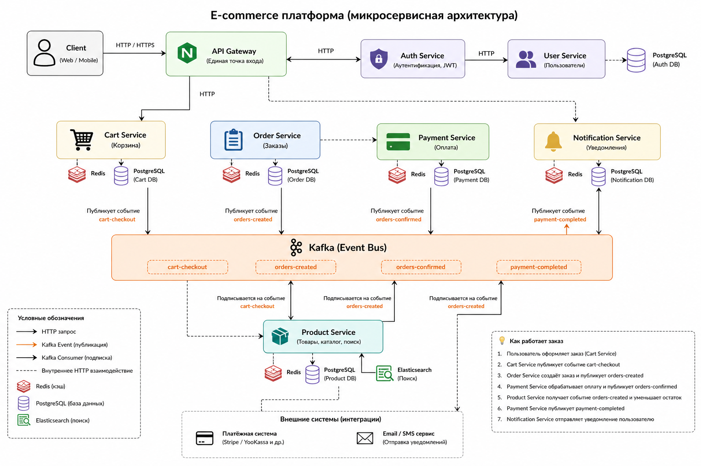
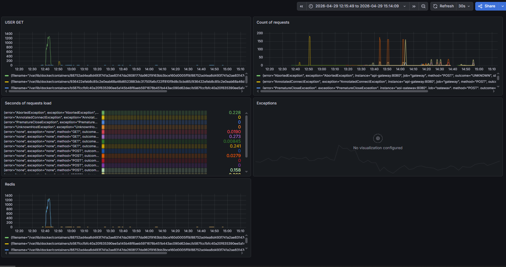

# 🛒 E-commerce Microservices Platform

## 📌 Описание

Прототип масштабируемой e-commerce платформы с микросервисной архитектурой и event-driven взаимодействием через Kafka, реализующий полный цикл обработки заказов и демонстрирующий production-подход к разработке backend-систем.

---

## 🏗 Архитектура проекта

Проект построен на микросервисной архитектуре и состоит из следующих сервисов:

* **API Gateway** — единая точка входа для всех клиентских запросов
* **Auth Service** — регистрация, аутентификация пользователей, JWT
* **User Service** — управление пользователями
* **Product Service** — товары, поиск (Elasticsearch)
* **Cart Service** — корзина
* **Order Service** — обработка заказов
* **Payment Service** — имитация оплаты
* **Notification Service** — уведомления

Взаимодействие между сервисами построено через **Kafka (event-driven архитектура)**.

---
### 📊 Схема архитектуры

Схема взаимодействия микросервисов и event-driven обработки заказов:



## 🔄 Основной поток обработки заказа

1. Пользователь добавляет товар в корзину (**Cart Service**)
2. Отправляется событие `cart-checkout` в Kafka
3. **Order Service** создаёт заказ → событие `orders-created`
4. **Product Service** уменьшает stock
5. **Payment Service** выполняет оплату
6. Отправляется событие `payment-completed`
7. **Notification Service** отправляет уведомление

### ⚙️ Особенности:

* at-least-once delivery
* идемпотентность через `eventId`
* обработка дубликатов
* DLQ (Dead Letter Queue)

---

## ⚙️ Технологии

### 🧩 Backend

* Java 21
* Spring Boot
* Spring Cloud Gateway
* Spring Security + JWT

### 📡 Взаимодействие

* Apache Kafka
* Feign Client

### 💾 Хранение данных

* PostgreSQL
* Redis
* Elasticsearch

### 🐳 DevOps

* Docker / Docker Compose
* GitHub Actions (CI/CD)

### 📊 Мониторинг

* Prometheus
* Grafana
* Loki + Promtail

### 🧪 Тестирование

* JUnit / Mockito
* k6
* Apache Benchmark (ab)

---

## 🚀 Запуск проекта

### 📋 Требования

* Docker
* Docker Compose

### ▶️ Клонирование репозитория

```bash
git clone https://github.com/Toostik/Online-store.git
```

```bash
cd Online-store
```

### ▶️ Быстрый старт

```bash
docker compose up -d --build
```

API Gateway:

```
http://localhost:8080
```

---

## 🔐 Авторизация

**Регистрация:**

```
POST /api/auth/register
```

**Логин:**

```
POST /api/auth/login
```

**Заголовок:**

```
Authorization: Bearer <your_token>
```

---

## 🧪 Пример сценария


```
POST /api/categories/create
POST /api/products/create
GET /api/products/all
POST /api/carts/add
GET /api/carts/order
```
## Тело запроса для создания категории товара

```bash
{
    "name": "Product Category"
}
```

## Тело запроса для создания товара

```bash
{
    "name": "Product",
    "price": 10000,
    "stockQuantity": 100,
    "categoryId": 1 
}
```

## Тело запроса для добавления товара в корзину

```bash
[
    {
        "productId": 1,
        "quantity": 2
    }
]
```

## ⚙️ Частичный запуск

**Авторизация:**

```bash
docker compose up -d zookeeper elasticsearch redis postgres kafka api-gateway auth-service user-service
```

**Заказы:**

```bash
docker compose up -d zookeeper elasticsearch redis postgres kafka api-gateway cart-service order-service product-service
```

**Полный цикл:**

```bash
docker compose up -d zookeeper elasticsearch redis postgres kafka api-gateway cart-service order-service product-service payment-service notification-service
```

---

## 📊 Мониторинг

* Метрики через Prometheus
* Визуализация в Grafana
* Логи через Loki

### 📈 Пример метрик



---

## 🧪 Нагрузочное тестирование

* 10 000 запросов (GET /users)
* 10 000 запросов (POST /cart)
* k6: 50 пользователей / 30 секунд

### 🔍 Результаты

* система стабильно обрабатывает нагрузку
* корректная работа Kafka
* метрики доступны

---

## ❗ Ключевые решения

### 🔄 Event-driven

* слабая связанность
* масштабируемость

### 🛡 Идемпотентность

* защита от дублей

### ⚠️ DLQ

* обработка ошибок

### ⚡ Redis

* кеширование

### 🔍 Elasticsearch

* поиск + autocomplete

### 🔐 JWT

* access / refresh токены

### 📊 Observability

* метрики + логи

### 🔁 CI/CD

* автоматический запуск тестов

---

## 📌 Заключение

Проект демонстрирует построение распределённой системы с использованием микросервисной архитектуры, Kafka и современных инструментов backend-разработки.

Включает:

* асинхронную обработку
* мониторинг
* нагрузочное тестирование

Проект находится в развитии: планируется добавление интеграционных тестов и улучшение устойчивости системы.

---
